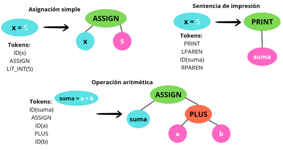

# Compilador de Python a C++

**Tipo de Compilador:** Source to source

Este compilador traduce programas sencillos escritos en Python a su equivalente en C++, enfocándose principalmente en operaciones aritméticas básicas (+, -, *, /), asignaciones de variables y el uso de tipos de datos int, float, str. El objetivo es mostrar cómo un programa en Python puede ser analizado léxica, sintáctica y semánticamente para luego generar un código equivalente en C++ que pueda ser compilado y ejecutado en un entorno real.

### Versiones de los lenguajes
- **Python:** `3.13.7`
- **C++:** `15.2.1` 

## Tabla de tokens

| Categoría | Ejemplo Python | Equivalente en C++ | Descripción |
| :--- | :--- | :--- | :--- |
| **Palabras Clave** | `class`, `def`, `return`, `if`, `else`, `while`, `for`, `None`, `True`, `False`, | `class`, N/A, `return`, `if`, `else`, `while`, `for`, `nullptr`, `true`, `false` | Instrucciones reservadas del lenguaje. |
| **Identificadores** | `x`, `y`, `suma`, `miVariable` | `x`, `y`, `suma`, `miVariable` | Nombre de variables, funciones, clases, etc. |
| **Operadores matemáticos** | `+`, `-`, `*`, `/`, `%`, `**` | `+`, `-`, `*`, `/`, `%`, `std::pow()` | Operaciones aritméticas. |
| **Operadores de asignación** | `=`, `+=`, `-=` | `=`, `+=`, `-=` | Asigación de un valor a una variable. |
| **Operadores de comparación** | `==`, `!=`, `<`, `>`, `<=`, `>=` | `==`, `!=`, `<`, `>`, `<=`, `>=` | Comparan dos valores y devuelven un resultado booleano (`True` o `False`). |
| **Operadores lógicos** | `and`, `or`, `not` | `&&`, `\|\|` , `!` | Realizan operaciones lógicas para combinar o negar expresiones booleanas. |
| **Literales STR** | `"Hola"`, `'hola'`, `"""texto"""` |  `const char*`, `std::string`,  `R"(texto)"` | Representan secuencias de caracteres. |
| **Literales INT** | `5`, `10`, `-5` | `int`, `long`, `short` | Representan valores numéricos enteros. |
| **Literales Float** | `2.7182`, `-7.1` | `float`, `double` | Representación de valores numéricos de punto flotante. |
| **Comentarios** | `# Comentario`, `""" Docstring """` | `// Comentario`, `/* Docstring */` | Texto ignorado por el compilador, utilizado para documentar. |
| **Delimitadores** | `:`, `;`, `,`, `(`, `)`, `[`, `]`, `{`, `}`, `\n` | `;`, `,`, `{`, `}`, `(`, `)`, `[`, `]`, | Caracteres que definen la estructura y separación del código. |

## Fases del compilador
- **1. Análisis Léxico:** En esta etapa el compilador lee el código fuente en Python y lo divide en tokens, que son las unidades más pequeñas con significado (palabras clave, identificadores, operadores, literales y delimitadores).

- **2. Análisis Sintáctico:** Con la lista de tokens, el compilador construye el Árbol de Sintaxis Abstracta (ATS), organizando las estructuras del programa y verificando que la secuencia de tokens tenga una forma válida (por ejemplo, que una asignación esté bien escrita).

- **3. Análisis Semántico:** Se validan los tipos de datos y la coherencia de las operaciones. Aquí se construye la tabla de símbolos, registrando las variables y sus tipos (int, float, str). Se revisa que las operaciones sean compatibles, por ejemplo, que no se sumen enteros con cadenas.

- **4. Generación de Código Final (C++):** Una vez validadas las fases anteriores, el compilador traduce el programa en Python a un programa equivalente en C++, manteniendo la misma lógica y asegurando que pueda ser compilado y ejecutado en un compilador real de C++.

### Diagrama de flujo de datos del compilador

<div align="center">
  
</div>


### Diagrama de árbol de sintaxis abstracta(ATS)
<div align="center">
  
</div>

## Uso del compilador

Para ejecutar el compilador, utiliza la terminal siguiendo la siguiente sintaxis:

``` shell
python main.py [Opciones]
```

> **Nota:** El apartado de "Opciones" es opcional para la ejecución del compilador.

### Parámetros 

- `python`  ->  Intérprete de Python.
- `main.py` ->  Archivo principal del compilador. 
- `-t`, `-a`, `-h`  ->  Opciones que ejecutan diferentes funciones del compilador

#### Opciones del  compilador

- `-t` -> Muestra la lista de tokens del archivo a compiliar.
- `-a` -> Muestra el árbol de sintaxis abstracta(ATS) del archivo a compilar.
- `-h` -> Muestra la ayuda y opciones del compilador.
