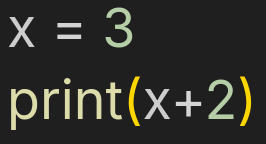
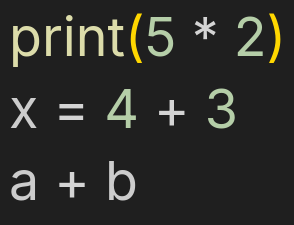
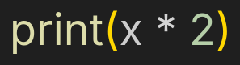
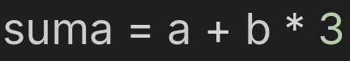
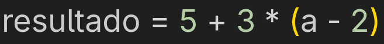
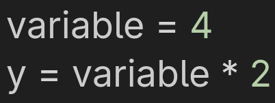
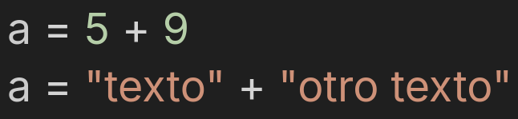

# Compilador de Python a C++

**Tipo de Compilador:** Source to source

Este compilador traduce programas sencillos escritos en **Python** a su equivalente en **C++**, enfocándose principalmente en operaciones aritméticas básicas **(+, -, *, /)**, asignaciones de variables y el uso de tipos de datos **int**, **float**, **str**. El objetivo es mostrar cómo un programa en Python puede ser **analizado léxica**, **sintáctica** y **semánticamente** para luego generar un código equivalente en C++ que pueda ser compilado y ejecutado en un entorno real.

### Versiones de los lenguajes
- **Python:** `3.13.7`
- **C++:** `15.2.1` 

## Tabla de tokens <a name="id1"></a>

| Categoría | Ejemplo Python | Equivalente en C++ | Descripción |
| :--- | :--- | :--- | :--- |
| **Palabras Clave** | `class`, `def`, `return`, `if`, `else`, `while`, `for`, `None`, `True`, `False`, | `class`, N/A, `return`, `if`, `else`, `while`, `for`, `nullptr`, `true`, `false` | Instrucciones reservadas del lenguaje. |
| **Identificadores** | `x`, `y`, `suma`, `miVariable` | `x`, `y`, `suma`, `miVariable` | Nombre de variables, funciones, clases, etc. |
| **Operadores matemáticos** | `+`, `-`, `*`, `/`, `%`, `**` | `+`, `-`, `*`, `/`, `%`, `std::pow()` | Operaciones aritméticas. |
| **Operadores de asignación** | `=`, `+=`, `-=` | `=`, `+=`, `-=` | Asigación de un valor a una variable. |
| **Operadores de comparación** | `==`, `!=`, `<`, `>`, `<=`, `>=` | `==`, `!=`, `<`, `>`, `<=`, `>=` | Comparan dos valores y devuelven un resultado booleano (`True` o `False`). |
| **Operadores lógicos** | `and`, `or`, `not` | `&&`, `\|\|` , `!` | Realizan operaciones lógicas para combinar o negar expresiones booleanas. |
| **Literales STR** | `"Hola"`, `'hola'`, `"""texto"""` |  `const char*`, `std::string`,  `R"(texto)"` | Representan secuencias de caracteres. |
| **Literales INT** | `5`, `10`, `-5` | `int`, `long`, `short` | Representan valores numéricos enteros. |
| **Literales Float** | `2.7182`, `-7.1` | `float`, `double` | Representación de valores numéricos de punto flotante. |
| **Comentarios** | `# Comentario`, `""" Docstring """` | `// Comentario`, `/* Docstring */` | Texto ignorado por el compilador, utilizado para documentar. |
| **Delimitadores** | `:`, `;`, `,`, `(`, `)`, `[`, `]`, `{`, `}`, `\n` | `;`, `,`, `{`, `}`, `(`, `)`, `[`, `]`, | Caracteres que definen la estructura y separación del código. |

## Fases del compilador <a name="id2"></a>

- **1. Análisis Léxico:** En esta etapa el compilador lee el código fuente en Python y lo divide en tokens, que son las unidades más pequeñas con significado (palabras clave, identificadores, operadores, literales y delimitadores).

- **2. Análisis Sintáctico:** Con la lista de tokens, el compilador construye el Árbol de Sintaxis Abstracta (ATS), organizando las estructuras del programa y verificando que la secuencia de tokens tenga una forma válida (por ejemplo, que una asignación esté bien escrita).

- **3. Análisis Semántico:** Se validan los tipos de datos y la coherencia de las operaciones. Aquí se construye la tabla de símbolos, registrando las variables y sus tipos (int, float, str). Se revisa que las operaciones sean compatibles, por ejemplo, que no se sumen enteros con cadenas.

- **4. Generación de Código Final (C++):** Una vez validadas las fases anteriores, el compilador traduce el programa en Python a un programa equivalente en C++, manteniendo la misma lógica y asegurando que pueda ser compilado y ejecutado en un compilador real de C++.

### Diagrama de flujo de datos del compilador

<div align="center">
  
</div>


### Diagrama de árbol de sintaxis abstracta(ATS)
<div align="center">
  
</div>

### Reglas del analizador sintáctico
**1.	Regla del Programa (Programa):** La primera regla sintáctica define la estructura general del programa. Indica que un programa está formado por una secuencia de sentencias (instrucciones), que pueden estar separadas por saltos de línea.
EJEMPLO:

<div align="center">
  
</div>

> **Nota:** Aquí el programa tiene dos sentencias válidas: una asignación y una instrucción de impresión.

**2.	Regla de la Sentencia (Sentencia):** La segunda regla describe qué tipos de sentencias pueden aparecer dentro de un programa. En este caso, una sentencia puede ser una instrucción de impresión (print), una asignación de variable, o una expresión aislada (como una operación matemática que no se guarda en ninguna variable).
EJEMPLO:

<div align="center">
  
</div>

> **Nota:** Las tres líneas anteriores representan los tres tipos de sentencias que el parser sabe interpretar.

**3.	Regla de la Instrucción print (IMPRIMIR):** La tercera regla específica cómo debe escribirse una instrucción print. Según la gramática, una sentencia print debe comenzar con la palabra clave print, seguida de un paréntesis de apertura, una expresión válida dentro de los paréntesis, y finalmente un paréntesis de cierre.
EJEMPLO:

<div align="center">
  
</div>

> **Nota:** Esta regla mantiene la coherencia con la sintaxis moderna de Python, donde el uso de paréntesis en print es obligatorio.

**4. Regla de Asignación (Assign)**
La cuarta regla sintáctica define cómo se realiza una asignación de valores a variables. En esta estructura, primero debe aparecer un identificador (el nombre de la variable), seguido del operador de asignación =, y finalmente una expresión que representa el valor que se le asignará.
EJEMPLO:

<div align="center">

</div>

> **Nota:** Aquí, el identificador suma recibe el valor resultante de la expresión a + b * 3.

5. **Reglas de expresiones y operaciones (Expr, Term, Factor):** Esta regla define cómo se construyen las expresiones aritméticas y el orden en que deben evaluarse las operaciones. Una expresión (Expr) puede contener uno o varios términos separados por los operadores de suma (+) o resta (-). A su vez, cada término (Term) puede incluir factores separados por los operadores de multiplicación (*) o división (/). 
EJEMPLO:

<div align="center">

</div>

> **Nota:** En este ejemplo, el parser evalúa primero la multiplicación dentro del paréntesis y luego la suma, siguiendo las reglas de precedencia aritmética.

### Reglas del analizador semántico

1. **Regla de tipos:** Esta regla verifica que las operaciones sean compatibles, es decir, no sumar un entero con una cadena, asegurando la coherencia entre tipo de expresiones, asignaciones y llamadas de funciones. EJEMPLO:

<div align="center">

</div>

2. **Regla de declaración:** Esta regla exige que toda variable, función u otro identificador sea declarado antes de usarse, permitiendo asociar cada identificador con su tipo, alcance y demas propiedades para su posterior análisis. EJEMPLO:

<div align="center">

</div>

## Uso del compilador <a name="id3"></a>

Para ejecutar el compilador, utiliza la terminal siguiendo la siguiente sintaxis:

``` shell
python main.py [Opciones]
```

> **Nota:** El apartado de "Opciones" es opcional para la ejecución del compilador.

### Parámetros 

- `python`  ->  Intérprete de Python.
- `main.py` ->  Archivo principal del compilador. 
- `-t`, `-a`, `-h`  ->  Opciones que ejecutan diferentes funciones del compilador

#### Opciones del  compilador

- `-t` -> Muestra la lista de tokens del archivo a compiliar.
- `-a` -> Muestra el árbol de sintaxis abstracta(ATS) del archivo a compilar.
- `-h` -> Muestra la ayuda y opciones del compilador.
